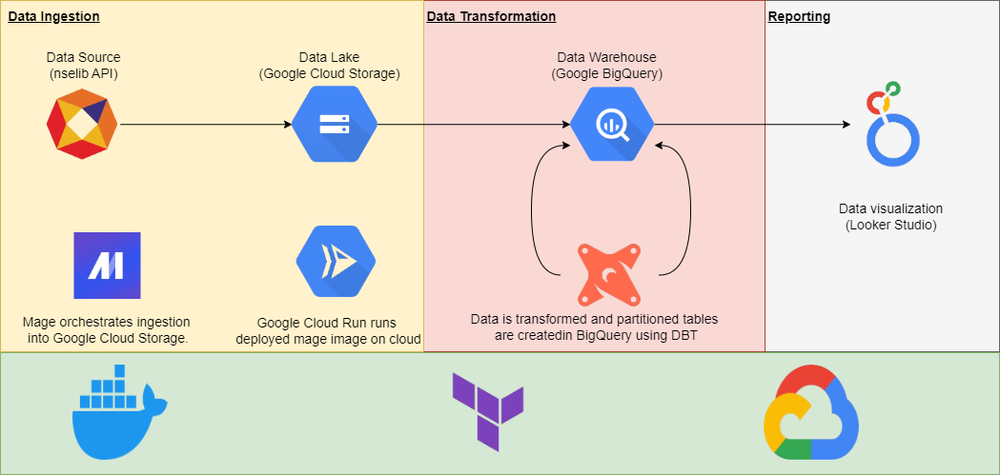

# nse-data-engineering

## Index
- [Problem statement](#problem-statement)
- [Dataset](#dataset)
- [Pre requisites](#pre-requisites)
- [Tools and Technologies used](#tools-and-technologies-used)
- [Architecture](#architecture)
- [Project Replication Instructions](#trying-out-yourself)

## Problem statement  
The aim of this project is to build an end-to-end data pipeline (including a dashboard) for analysing and visualizing National Stock Exchange (NSE) data.

This project provides a simple dashboard for viewing trends and insights of NSE on a daily basis.

This dashboard could help answer questions such as:
1. Sector wise trade activity
1. Industry wise trade activity
1. Biggest increased/decreased stocks
1. Change percent of a particular stock

## Dataset

This project uses the nselib python package to fetch bhavcopy data. Expected volume from source is around `2500 records per day`

#### What is bhavcopy?

> Bhavcopy (ticker tape in Indian context) is a daily snapshot of all the trades executed on the National Stock Exchange of India (NSE) . 

## Pre requisites

 * Python
 * Docker + Docker-compose
 * GCP
 * Terraform
 * DBT developer project

## Tools and Technologies used

 * **Docker + Docker-compose** - Used to maintain consistent versions across environments and define/share multi-containers
 
 * **[Mage](./mage.md)** - Used to create and orchestrate the ETL (extract, transform, load) pipelines for the stock data analysis project.

 * **Terraform** - Used to automate the deployment and management of infrastructure on Google Cloud Platform (GCP)

 * **GCP** 
    * [BigQuery](./bigquery.md) is used as data-warehouse to store and query the stock data 

    * Google Cloud Storage is used as data lake to store the raw data before it is transformed

    * [Cloud Run](./mage_gcp_deployment.md) is used for running deployed Mage pipelines on cloud
    
    * [looker_studio](./looker_studio.md) - Used for creating a dashboard to visaulize the data

 * **[dbt](./dbt.md)** - Used to transform the raw stock data to make it more suitable for analysis.

 ## Architecture

 

## Trying out yourself!

[Execution Steps](https://github.com/Shivakumar-Guhesh/nse-data-engineering/blob/main/setup.md)

  - [Python](./setup.md#python-dependencies)
  - [Docker](./setup.md#docker)
  - [Terraform](./setup.md#terraform)
  - [Mage](./setup.md#mage)
  - [BigQuery](./setup.md#bigquery)
  - [DBT](./setup.md#dbt)

## Dashboard

[LookerStudio Link](https://lookerstudio.google.com/reporting/989469a8-23d3-47c0-8f04-6df30224075f)

  Overall_market Page
   

  Symbol Wise Reports
  

  > Stocks that have their current price above the 50-day moving average indicate that the stock is experiencing a bullish trend and have the potential to reach a higher stock price and vice versa

Special thanks to  [DataTalks.Club](https://datatalks.club/) for 
offering this Data Engineering course completely free

*(This project is the course-project of data-engineering-zoomcamp 2024*

*https://github.com/DataTalksClub/data-engineering-zoomcamp*
